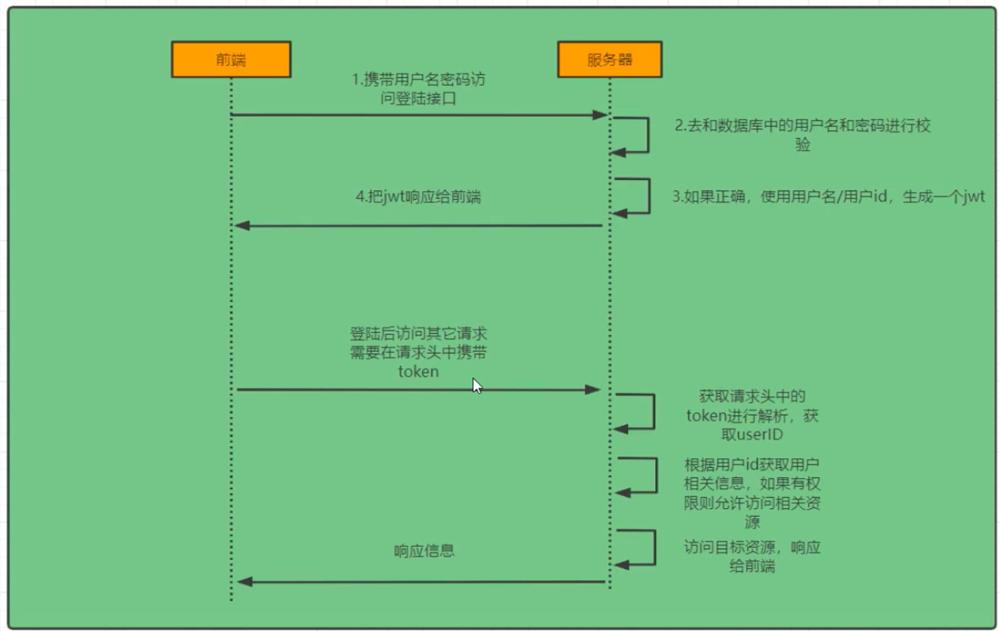

# SecurityQuickStart
SpringSecurity框架


# 认证
### 登陆流程校验


### SpringSecurity完整流程


# 其他
### 文档
markdown粘贴图片插件【Paste images into Markdown】 
### 如何查看Mac端口号以及占用情况
```text
通过终端命令
命令 lsof -i tcp:port （port替换成端口号，比如6379）可以查看该端口被什么程序占用，
并显示PID，方便KILL（kill pid）  
lsof(list open files)
1.查看端口被哪个程序占用
   sudo lsof -i tcp:port
   如： sudo lsof -i tcp:8082
2.看到进程的PID，可以将进程杀死。
   sudo kill -9 PID
   如：sudo kill -9 3210
```